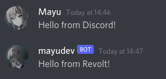
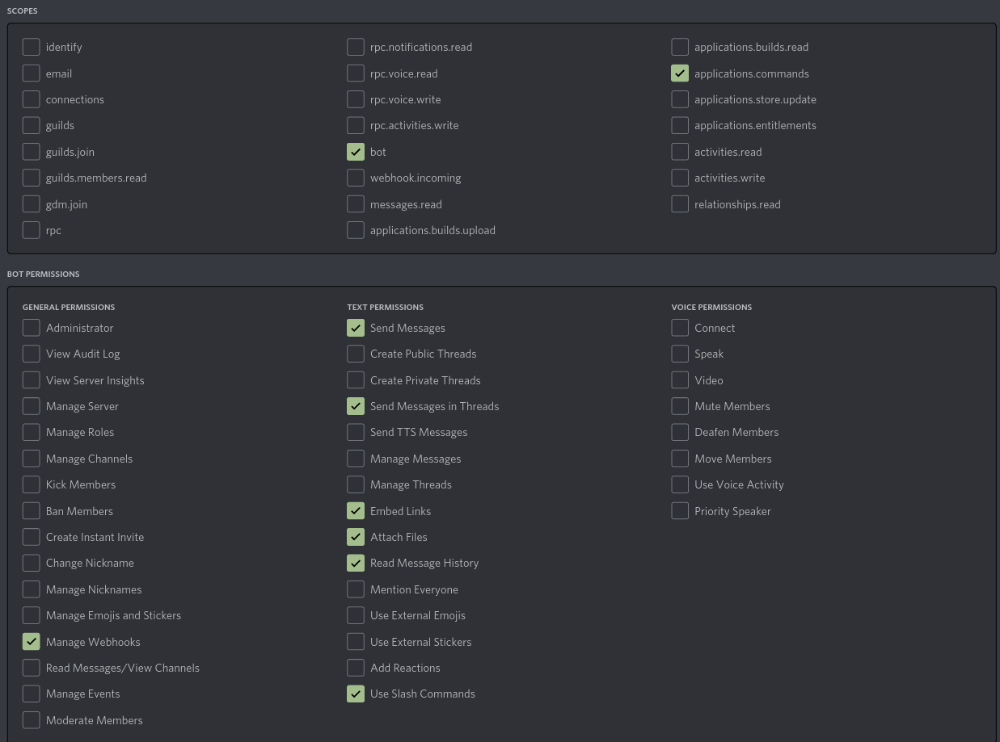

<p align="center">
  
</p>

<h1 align="center">revcord</h1>
<p align="center">
  
  
  
</p>

<p align="center"><b>🌉 A cord to connect your Revolt and Discord servers</b></p>

🔗 A bridge for Discord and [Revolt](https://revolt.chat) with easy setup through commands, written in TypeScript using [revolt.js](https://github.com/revoltchat/revolt.js).

## 📔 Features
- [x] Bridge messages between platforms
- [x] Bridge attachments
- [x] Bridge replies
- [x] Bridge message edit and delete
- [x] Bridge embeds
- [x] Seamlessly display user information

 

## 🔩 Setup

New: You can use [Docker](#using-docker) instead.

**Node v16+ is required!**

Important: this bot is meant to be used in one server (Discord+Revolt), but can be used in more as long as they share the same admin.

1. Clone this repository, install dependencies and build
```sh
git clone https://github.com/mayudev/revcord
cd revcord
npm install
npm run build
```
2. Create a bot in Discord ([Guide](https://discordjs.guide/preparations/setting-up-a-bot-application.html#creating-your-bot)) and Revolt (Open user settings -> `My Bots` -> `Create a bot`)
3. Place the relevant tokens in environment variables. The easiest way is to create a `.env` file (yes, a file called `.env`):
```
DISCORD_TOKEN = ...
REVOLT_TOKEN = ...
```
Of course, replace ... with tokens.

4. **Important!** Make sure to select the following permissions in URL Generator when making an invite for your bot (Your bot in Discord Developers -> `OAuth2` -> `URL Generator`) (or if you're lazy, just select `Administrator`) Note **applications.commands**!
   


5. **Important!** On Revolt, make sure to add the bot to a role that has the **Masquerade** permission!


6. Invite the bot to to a Revolt and Discord server.
7. Start the bot using `npm start`.

Note: it's recommended to use something like [pm2](https://pm2.keymetrics.io/) or [nodemon](https://nodemon.io/) to run the bot. Make sure to pass the `--experimental-specifier-resolution=node` flag to node manually, otherwise it will not run (it's included in the default start script).

### Using Docker

You need Docker and docker-compose installed.

Follow the steps above to create a `.env` file[^1]. You do not have to run `npm install` and `npm run build`, obviously. Also, make sure your bots have all the required permissions as explained above.

Before you run docker-compose, use `touch revcord.sqlite` to create the database file and leave it empty.

Then you should be ready to go.

```
docker-compose up -d
```

[^1]: Alternatively, you can edit the `docker-compose.yml` file appropriately. Make sure to remove `./.env:/app/.env` below `volumes:` so it won't complain when you don't have a `.env` file.


## 🔧 Configuration

### with commands

You can use either slash commands on Discord or `rc!` prefix on Revolt (use `rc!help` to show all commands)

To use the commands, **you** need the `Administrator` permission on Discord. On Revolt, only the server owner can run them (for now).

### Connecting Discord and Revolt channels 

From **Discord**:
```
/connect <Revolt channel name or ID>
```

From **Revolt**:
```
rc!connect <Discord channel name or ID>
```

For example:
```
# From Discord
/connect lounge
/connect 01AB23BC34CD56DE78ZX90WWDB

# From Revolt
rc!connect general
rc!connect 591234567890123456
```

✔️ Send a message to see if it works. Try editing and deleting it.

### Removing the connection

From **Discord**:
```
/disconnect
```

From **Revolt**:
```
rc!disconnect
```

You don't have to specify any channel. It will disconnect the channel the command is sent in.

### Showing connections

From **Discord**:
```
/connections
```

From **Revolt**:
```
rc!connections
```

### Toggling bots

You can toggle whether messages sent by bots should be forwarded. It's enabled by default (it's requied for NQN to work properly).

Use either `rc!bots` or `/bots`

### with mappings.json (not recommended)

#### This is not recommended!

1. Create a `mappings.json` file in the root directory.
2. Use the following format:
```json
[
  {
    "discord": "discord_channel_id",
    "revolt": "revolt_channel_id"
  },
  {
    "discord": "another_discord_channel_id",
    "revolt": "another_revolt_channel_id"
  }
]
```
